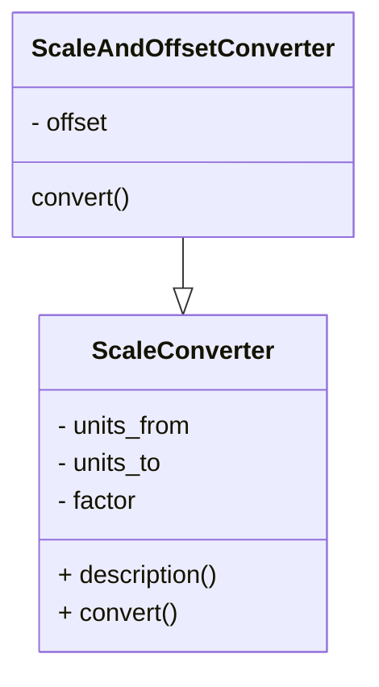

# portfolio-python
These are my portfolio projects using Python Programming Language intended for interested clients. 

## 0. Begin Here
### Working with Python Environment
#### 1. Each project gets its own python environment. 
    Default directory for env is: .venv
#### 2. "venv" is used for virtual python environments.
#### 3. Using python env: 
##### 3a. Check python version, use latest:
```bash
sap@Sanjays-MacBook-Air use_jupyter % python3 --version
Python 3.13.3
```

##### 3b. Create python env: 
```bash
sap@Sanjays-MacBook-Air use_jupyter % python3 -m venv .venv
```
##### 3c. Check newly created .venv directory: 
```bash
sap@Sanjays-MacBook-Air use_jupyter % ls -la
drwxr-xr-x  5 sap  staff    160 Sep  2 22:42 .
drwxr-xr-x  4 sap  staff    128 Sep  2 22:32 ..
-rw-r--r--@ 1 sap  staff   6148 Sep  2 22:32 .DS_Store
drwxr-xr-x@ 7 sap  staff    224 Sep  2 22:42 .venv
-rw-r--r--@ 1 sap  staff  18343 Sep  2 22:33 how-to-python.ipynb
```
##### 3d. Activate environment: 
```bash
sap@Sanjays-MacBook-Air use_jupyter % source .venv/bin/activate
```
##### 3e. Install requirements using requirements.txt 
```bash
(.venv) sap@Sanjays-MacBook-Air use_jupyter % pip install -r requirements.txt
Collecting jupyterlab... 
```
##### 3f. If new libraries are used, update requirements file: 
###### Manual: 
Maually add exact library that is installed using 'python3 -m pip install <lib_name>' command.

E.g. To install Jupyter Lab: 
```bash
(.venv) sap@Sanjays-MacBook-Air use_jupyter % python3 -m pip install jupyterlab
```
Manually append: jupyterlab==4.4.6 to requirements.txt file 
###### Update full list: 
```bash
(.venv) sap@Sanjays-MacBook-Air use_jupyter % pip freeze > requirements_full.txt 
```
#### 4. Start jupyterlab: 
```bash
(.venv) sap@Sanjays-MacBook-Air use_jupyter % jupyter lab
```
#### 5. deactivate the environment:
```bash
(.venv) sap@Sanjays-MacBook-Air use_jupyter % deactivate 
```

### Lessons in Python using Jupyter Notebook (please skip this section to jump to projects)
Here is some information from a great book on Programming the Raspberry Pi by Simon Monk [1].

#### 1. Printing text

#### 2. Variables 

#### 3. Importing libraries (aka modules)

#### 4. For Loop
Example: Dice\
Example: Double Dice

#### 5. If Else and Elif 
Example: Two mutually exclusive clauses\
Example: Three mutually exclusive clauses

#### 6. While Loop 
* A well-known principle in programming is DRY (Don’t Repeat Y ourself).
* The condition for staying in the loop is permanently set to True. The loop will continue until it gets to break, which will only happen after throwing a double 6.

Example: Double Dice\
Example: While Loop with Break

#### 7. Strings 

#### 8. Lists 
* A string is a list of characters

Example: Complex structures, list of list \
Example: List with For Loop 

#### 9. Functions 
* As programs get larger, things get more complicated and it becomes necessary to break up your programs into units called functions. 
* There are better ways still of structuring our programs using classes and modules.
* The biggest problem in software development of any sort is managing complexity.
* The best programmers write software that is easy to look at and understand and requires very little in the way of extra explanation. 
* Functions are a key tool in creating easy-to-understand programs that can be changed without difficulty or risk of the whole thing falling into a crumpled mess.

Example: Hello n\
Example: Hangman Game 

#### 10. Dictionaries 
* Lists: work best when accessing data starting at beginning and working way through. 
* But when it comes to accessing a particular entry, they can be slow and inefficient. 
* It is like a book without index or table of contents. You have to read through whole. 
* Dictionaries: Provide more efficient means of accessing a data structure, going straight to an item of interest. 
* A value is associated with a key. Use the key to ask for a value. 
* The keys and values are created while the program is running. 

* The dictionary does not keep track of the order in which items were defined.
* KEY: string / number / tuple 
* VALUE: number, list, dictionary 

#### 11. Tuples 
* Tuples look like lists, but without the square brackets. 
* Tuples are immutable. You cannot change them. Strings and numbers are also immutable. 
* If a tuple is just a list that you cannot reassign, what is the use? 
* Tuple provides useful way of creating 'a temporary collection of items.
* There are some neat tricks using tuples. 

Example: Multiple Assignment\
Example: Multiple Return Values 

#### 12. Exceptions 
* Used to flag when something goes wrong in the program. 
* Python has a mechanism for intercepting errors and allowing to handle them in a custom way. 
* There is a hierarchy of different types of errors that can be caught. 

#### 13. Summary of useful functions 
| **Numbers** | **Strings** | **Lists** | **Dictionary** | **Type Conversions** |
|---|---|---|---|---|
| abs(x) | s.capitalize() | del(a[i:j]) | len(d) | float() |
| bin(x) | s.center(width) | a.append(x) | del(dkey) | int() | 
| complex(r, i) | s.endswith(str) | a.count(x) | key in d | int('value', base) | 
| hex(x) | s.find(str)| a.index(x) | d.clear() | list('string') | 
| oct(x) | s.format(args) | a.insert(i, x) | get(key, default) | list(dict) | 
| round(x, n) | s.isalnum() | a.pop() | --- | --- | 
| math.factorial(n) | s.isalpha() | a.remove(x) | --- | --- | 
| math.pow(x, y) | s.isspace() | a.reverse() | --- | --- | 
| math.sqrt(x) | s.ljust(width) | a.sort() | --- | --- | 
| math.sin, cos, tan,<br>asin, acos, atan | s.lower, s.replace(old, new), <br>s.split(), s.splitlines(),<br>s.strip(), s.upper() | --- | --- | --- | 

#### 14. Object Orientation: Modules, Classes and Methods
* Custom python library is called module 
* Object-orientation: programs are structured into classes, each responsible for its own behaviour. 
* This helps to keep a check on program complexity and makes it easier to manage. This is done using classes and methods. 

* Modules 
    * create a group of functions and provide them in a convenient form for others to use or reuse in different projects 
    * module groups multiple objects and functions in a simple and elegant way. 
    * module name is same as the file name in which its constituents are defined. 

* Using Modules
    * Somewhere in the Python installation is a file called random.py that contains the randint and other functions.
    * Since there are so many modules, there is a real danger that different modules might have functions with the same name. 
    * Solution: None of the functions in the imported module are visible unless we prepend the module name and then a dot onto the front of the function name.

#### 15. Importing from modules 
* using local name for a module, local to the python file
* When certain about conflict free usage 
* import everything in one scoop

#### 16. Useful Python Module and Libraries 
| Module Name | Use | 
|---|---| 
| string | string utilities | 
| datetime | dates and times  |
| math | math functions  |
| pickle | data structures  |
| urllib.request | webpages  |
| tkinter | GUI |

#### 17. Object Orientation 
* Modules are part of object orientation
* Object orientation has same goals of grouping related items together, providing multiple things in a convenient form, structuring program into classes such that each is responsible for its own behaviour. 
* It is about objects. 
* Here, 'abc' is a string. A string is an object. We are telling python that we want a copy of the string 'abc' but in uppercase. 
* In object orientation terms, abc is an instance of the built-in class str and upper is a method on the class str. 
* note: "instance of a class" and "method on a class" 

Example: how to find out the class of an object: 'abc'.__class__

#### 18. Classes 
* Defining Classes 
    * Create a class that does the job of converting measurements from one unit to another by multiplying a value by a scale factor. 
    * Give the class a catchy name 
    
Example: converter_using_class

* Notes on Classes 
    * def __init__() is a function definition. 
        * This function can only be used via an instance of this class. This is also called method for the class. 
        * This method is automatically called as part of initiation. 
        * Number of parameters depend on parameters supplied during class instance creation.
        * self is always the first parameter. Self refers to the object itself. 
        * inside __init__(): new variables are created using assignments. These variables belong to the object and have their initial values set from the parameter set passed. 
        * __init__() is used to initialize and assign variables with default values. 

#### 19.  Encapsulation with Classes 
* Class should encapsulate everything that has to do with the class. E.g. storing data in variables, methods on the data
* All methods (including __ __init__ __()) must have self as a first parameter. The methods may or maynot need it to access the data of the class to which it belongs. 
* Each data that the methods use is called parameter. 

#### 20. Inheritance 
* Concept used to reduce and sometimes eliminate repearing code. Recall the well known principle in programming: DRY = Don't Repeat Youself! 
* Idea of inheritance in classes is that when you want a specialized version of a class that already exists, you inherit all the parent class's variables and methods 
* and just add new ones or override the ones that are different. 
* Classes are documented using UML diagrams: 


Example: Class definition using inheritance
* This example explores the following important aspects:
    * Specifying the parent class duing sub-class definition 
    * Invoking a method from the parent class 
    * Overriding a method from the parent class
    * Reusing a method from the parent class because DRY! (Don't Repeat Yourself) 

<!-- Book References -->
[1]: " Programming the Raspberry Pi" by Simon Monk. 


## 1. Large Number Processing
This demonstrates:
1. Handling extremely large integers (math.factorial).
2. High-precision decimal arithmetic (decimal.Decimal).
3. Efficient processing of large datasets with big numbers.

#### Code
```python
# Increase Python's safety limit for converting big integers to string
sys.set_int_max_str_digits(1000000)

# 1. Arbitrary precision integers
large_factorial = math.factorial(5000)  
num_digits = len(str(large_factorial))  # number of digits in 5000!

# 2. High precision floating-point arithmetic
getcontext().prec = 50  # set precision to 50 decimal places
a = Decimal(1) / Decimal(7)             # precise fraction
b = Decimal(355) / Decimal(113)         # pi approximation

# 3. Processing a dataset of big integers
dataset = [10**50 + i for i in range(5)]  # simulate 5 huge integers
dataset_sum = sum(dataset)
```

#### Usage
```bash
(terminal)~% sudo python3 large-number-demo.py
```

#### Output
```txt 
Digits in 5000!: 16326
1/7 with high precision: 0.14285714285714285714285714285714285714285714285714
Approximation of pi: 3.1415929203539823008849557522123893805309734513274
Sum of dataset of huge numbers: 500000000000000000000000000000000000000000000000010
```

## 2. Prompt Automation 
This demonstrates:
1. Handling LLM/GPT API services including model selection.
2. Function definition for setting response, messages and temperature. 
3. Basic Architecture for prompt and response. 

#### Code
```python
# Function 
def llm_response(prompt):
    response = openai.ChatCompletion.create(
        model='gpt-3.5-turbo',
	messages=[{'role':'user', 'content':prompt}],
	temperature=0
    )
    return response.choices[0].message['content']
```

#### Usage
```bash
(terminal)~% sudo python3 openai_1.py
```

#### Output
```txt 
Hello, World
Positive
```

## 3. Python for Machine Learning (ML)  
This demonstrates:
1. Using scikit-learn for machine learning applications. 
2. scikit-learn is built on numpy, scipy, and matplotlib
3. Open source, commercially usable - BSD license