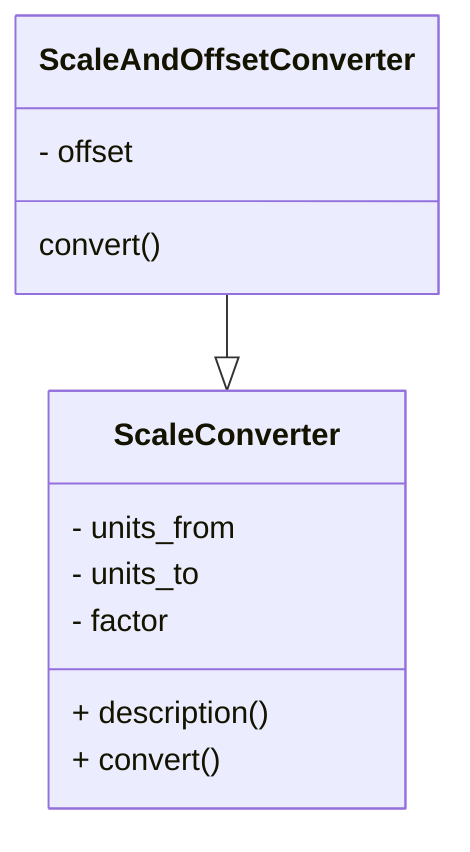

# portfolio-python
These are my portfolio projects using Python Programming Language intended for interested clients. 

## 0. Begin Here
### 0.1 Working with Python Environment
#### 0.1.1. Each project gets its own python environment. 
    Default directory for env is: .venv
#### 0.1.2. "venv" is used for virtual python environments.
#### 0.1.3. Using python env: 
##### 0.1.3a. Check python version, use latest:
```bash
sap@Sanjays-MacBook-Air use_jupyter % python3 --version
Python 3.13.3
```

##### 0.1.3b. Create python env: 
```bash
sap@Sanjays-MacBook-Air use_jupyter % python3 -m venv .venv
```
##### 0.1.3c. Check newly created .venv directory: 
```bash
sap@Sanjays-MacBook-Air use_jupyter % ls -la
drwxr-xr-x  5 sap  staff    160 Sep  2 22:42 .
drwxr-xr-x  4 sap  staff    128 Sep  2 22:32 ..
-rw-r--r--@ 1 sap  staff   6148 Sep  2 22:32 .DS_Store
drwxr-xr-x@ 7 sap  staff    224 Sep  2 22:42 .venv
-rw-r--r--@ 1 sap  staff  18343 Sep  2 22:33 how-to-python.ipynb
```
##### 0.1.3d. Activate environment: 
```bash
sap@Sanjays-MacBook-Air use_jupyter % source .venv/bin/activate
```
##### 0.1.3e. Install requirements using requirements.txt 
```bash
(.venv) sap@Sanjays-MacBook-Air use_jupyter % pip install -r requirements.txt
Collecting jupyterlab... 
```
##### 0.1.3f. If new libraries are used, update requirements file: 
###### Manual: 
Maually add exact library that is installed using 'python3 -m pip install <lib_name>' command.

E.g. To install Jupyter Lab: 
```bash
(.venv) sap@Sanjays-MacBook-Air use_jupyter % python3 -m pip install jupyterlab
```
Manually append: jupyterlab==4.4.6 to requirements.txt file 
* tip to automate manual process:
```bash
pip freeze | grep 'jupyterlab' >> requirements.txt
echo "jupyterlab==4.4.6" >> requirements.txt
```
###### Update full list: 
```bash
(.venv) sap@Sanjays-MacBook-Air use_jupyter % pip freeze > requirements_full.txt 
```
#### 0.1.4. Start jupyterlab: 
```bash
(.venv) sap@Sanjays-MacBook-Air use_jupyter % jupyter lab
```
#### 0.1.5. deactivate the environment:
```bash
(.venv) sap@Sanjays-MacBook-Air use_jupyter % deactivate 
```

### 0.2 Lessons in Python using Jupyter Notebook (please skip this section to jump to projects)
Here is some information from a great book on Programming the Raspberry Pi by Simon Monk [1].

#### 0.2.1. Printing text

#### 0.2.2. Variables 

#### 0.2.3. Importing libraries (aka modules)

#### 0.2.4. For Loop
Example: Dice\
Example: Double Dice

#### 0.2.5. If Else and Elif 
Example: Two mutually exclusive clauses\
Example: Three mutually exclusive clauses

#### 0.2.6. While Loop 
* A well-known principle in programming is DRY (Don’t Repeat Y ourself).
* The condition for staying in the loop is permanently set to True. The loop will continue until it gets to break, which will only happen after throwing a double 6.

Example: Double Dice\
Example: While Loop with Break

#### 0.2.7. Strings 

#### 0.2.8. Lists 
* A string is a list of characters

Example: Complex structures, list of list \
Example: List with For Loop 

#### 0.2.9. Functions 
* As programs get larger, things get more complicated and it becomes necessary to break up your programs into units called functions. 
* There are better ways still of structuring our programs using classes and modules.
* The biggest problem in software development of any sort is managing complexity.
* The best programmers write software that is easy to look at and understand and requires very little in the way of extra explanation. 
* Functions are a key tool in creating easy-to-understand programs that can be changed without difficulty or risk of the whole thing falling into a crumpled mess.

Example: Hello n\
Example: Hangman Game 

#### 0.2.10. Dictionaries 
* Lists: work best when accessing data starting at beginning and working way through. 
* But when it comes to accessing a particular entry, they can be slow and inefficient. 
* It is like a book without index or table of contents. You have to read through whole. 
* Dictionaries: Provide more efficient means of accessing a data structure, going straight to an item of interest. 
* A value is associated with a key. Use the key to ask for a value. 
* The keys and values are created while the program is running. 

* The dictionary does not keep track of the order in which items were defined.
* KEY: string / number / tuple 
* VALUE: number, list, dictionary 

#### 0.2.11. Tuples 
* Tuples look like lists, but without the square brackets. 
* Tuples are immutable. You cannot change them. Strings and numbers are also immutable. 
* If a tuple is just a list that you cannot reassign, what is the use? 
* Tuple provides useful way of creating 'a temporary collection of items.
* There are some neat tricks using tuples. 

Example: Multiple Assignment\
Example: Multiple Return Values 

#### 0.2.12. Exceptions 
* Used to flag when something goes wrong in the program. 
* Python has a mechanism for intercepting errors and allowing to handle them in a custom way. 
* There is a hierarchy of different types of errors that can be caught. 

#### 0.2.13. Summary of useful functions 
| **Numbers** | **Strings** | **Lists** | **Dictionary** | **Type Conversions** |
|---|---|---|---|---|
| abs(x) | s.capitalize() | del(a[i:j]) | len(d) | float() |
| bin(x) | s.center(width) | a.append(x) | del(dkey) | int() | 
| complex(r, i) | s.endswith(str) | a.count(x) | key in d | int('value', base) | 
| hex(x) | s.find(str)| a.index(x) | d.clear() | list('string') | 
| oct(x) | s.format(args) | a.insert(i, x) | get(key, default) | list(dict) | 
| round(x, n) | s.isalnum() | a.pop() | --- | --- | 
| math.factorial(n) | s.isalpha() | a.remove(x) | --- | --- | 
| math.pow(x, y) | s.isspace() | a.reverse() | --- | --- | 
| math.sqrt(x) | s.ljust(width) | a.sort() | --- | --- | 
| math.sin, cos, tan,<br>asin, acos, atan | s.lower, s.replace(old, new), <br>s.split(), s.splitlines(),<br>s.strip(), s.upper() | --- | --- | --- | 

#### 0.2.14. Object Orientation: Modules, Classes and Methods
* Custom python library is called module 
* Object-orientation: programs are structured into classes, each responsible for its own behaviour. 
* This helps to keep a check on program complexity and makes it easier to manage. This is done using classes and methods. 

* Modules 
    * create a group of functions and provide them in a convenient form for others to use or reuse in different projects 
    * module groups multiple objects and functions in a simple and elegant way. 
    * module name is same as the file name in which its constituents are defined. 

* Using Modules
    * Somewhere in the Python installation is a file called random.py that contains the randint and other functions.
    * Since there are so many modules, there is a real danger that different modules might have functions with the same name. 
    * Solution: None of the functions in the imported module are visible unless we prepend the module name and then a dot onto the front of the function name.

#### 0.2.15. Importing from modules 
* using local name for a module, local to the python file
* When certain about conflict free usage 
* import everything in one scoop

#### 0.2.16. Useful Python Module and Libraries 
| Module Name | Use | 
|---|---| 
| string | string utilities | 
| datetime | dates and times  |
| math | math functions  |
| pickle | data structures  |
| urllib.request | webpages  |
| tkinter | GUI |

#### 0.2.17. Object Orientation 
* Modules are part of object orientation
* Object orientation has same goals of grouping related items together, providing multiple things in a convenient form, structuring program into classes such that each is responsible for its own behaviour. 
* It is about objects. 
* Here, 'abc' is a string. A string is an object. We are telling python that we want a copy of the string 'abc' but in uppercase. 
* In object orientation terms, abc is an instance of the built-in class str and upper is a method on the class str. 
* note: "instance of a class" and "method on a class" 

Example: how to find out the class of an object: 'abc'.__class__

#### 0.2.18. Classes 
* Defining Classes 
    * Create a class that does the job of converting measurements from one unit to another by multiplying a value by a scale factor. 
    * Give the class a catchy name 
    
Example: converter_using_class

* Notes on Classes 
    * def __init__() is a function definition. 
        * This function can only be used via an instance of this class. This is also called method for the class. 
        * This method is automatically called as part of initiation. 
        * Number of parameters depend on parameters supplied during class instance creation.
        * self is always the first parameter. Self refers to the object itself. 
        * inside __init__(): new variables are created using assignments. These variables belong to the object and have their initial values set from the parameter set passed. 
        * __init__() is used to initialize and assign variables with default values. 

#### 0.2.19.  Encapsulation with Classes 
* Class should encapsulate everything that has to do with the class. E.g. storing data in variables, methods on the data
* All methods (including __ __init__ __()) must have self as a first parameter. The methods may or maynot need it to access the data of the class to which it belongs. 
* Each data that the methods use is called parameter. 

#### 0.2.20. Inheritance 
* Concept used to reduce and sometimes eliminate repearing code. Recall the well known principle in programming: DRY = Don't Repeat Youself! 
* Idea of inheritance in classes is that when you want a specialized version of a class that already exists, you inherit all the parent class's variables and methods 
* and just add new ones or override the ones that are different. 
* Classes are documented using UML diagrams: 


Example: Class definition using inheritance
* This example explores the following important aspects:
    * Specifying the parent class duing sub-class definition 
    * Invoking a method from the parent class 
    * Overriding a method from the parent class
    * Reusing a method from the parent class because DRY! (Don't Repeat Yourself) 

#### 0.2.21. Files 
* Python can be used to access files by reading and writing data. 
* Python variables aren't permanent in nature. Files provide a means of making data more permanent. 
* Reading file 
* Reading a file along with error handling 
* Reading big files: following becomes important  
    * Time to read data 
    * Memory used to store the data 
#### 0.2.22. File System 
* Python uses Linux to perform file-system-type operations (e.g. moving, copying a file or a directory).
* The functions are in **Shell Utility (shutil)** package. These work on directories as well as files. 
* Some features also deal with *file permissions* and *metadata*.
* **General uses**: copy, move, rename, remove, search file or directory 
* To copy, move, rename a file: **copy**
* To copy, move, rename a directory (including contents): **copytree**
* To remove a directory (including contents): **rmtree** 
* To search a directory: **glob**
* To save and load data to file: **pickle**

#### 0.2.23 Internet 
* Most applications need to connect to the internet.
* Interaction with a web-server is done using HTTP/HTTPS requests. HTTP stands for Hypertext Transfer Protocol.
* The text is in HTML language. HTML stands for Hypertext Markup Language - language of the web pages. 

#### 0.2.24 Website scrapping
* Example sites for leaning to scrape: https://www.google.com/search?q=python, www.example.com
* "Regular Expressions in Python" comes handy when dealing with the raw data. They are useful for complex searches and validations of text. 
* Organizations do not like people "scraping" their web pages. Therefore, expect getting a warning or even getting banned from some sites.
* This action is very dependent on the web page structure and hence very scipts tend to be sensitive - small change in web page structure can break your script.
* A standard approach is to look for the official web service interface to the site. These services return processed data in XML or JSON format instead of raw HTML format.
* Read about "web services in Python"

#### 0.2.25 Graphical User Interfaces (GUIs) 
* Tkinter
    * A python interface to the Tk GUI system.
    * Tk is not specific to python and there are interfaces to it from many languages.
    * It runs on many operating systems including Linux and it the most commonly used tool for creating a GUI for Python.
    * Tkinter may or may not come loaded with Python, so installation might be required. 
* **Important Note**: You might have to reinstall Python in case the base doesn't have Tkinter already. In my case, I had to since my base python installation (version 3.13) didn't have Tkinter.
* Tkinter is the Python interface to Tcl/Tk, the GUI toolkit. 
* Here are some steps that help make sense of things: 
* In your virtual environment try some of the following to see if Tkinter is supported or not. 
```bash
# test 1: in terminal (bash/zsh)
python3 -c "import tkinter; print('tkinter OK', tkinter.TkVersion)"     # tkinter OK 9.0
python3 -c "import tkinter; tkinter._test()"    # GUI should pop-up
python3 -m tkinter    # GUI should pop-up
```
```python
# test 2: in python file 
import tkinter
tkinter._test()
print("Tkinter is installed and ready to use!")
``` 
* If above fails with *ModuleNotFoundError: No module named '_tkinter'*, do not worry. This just means that your virtual Python environment doesn't have Tkinter. 
* Immediate test is with your base python. Deactivate your virtual environment and run the same set of tests but now in your base python environment. Try following to learn more about your base installation: 
```bash
# learn more about your base Python installation 
python3 --version   # Python 3.13.3
which python3   # /opt/homebrew/bin/python3
python3 -c "import sys; print(sys.executable)"  # /opt/homebrew/opt/python@3.13/bin/python3.13

# By far the most comprehensive check
cat ./0_begin_here/use_jupyter/.venv/pyvenv.cfg    # expect following: 
# home = /opt/homebrew/opt/python@3.13/bin
# include-system-site-packages = false
# version = 3.13.3
# executable = /opt/homebrew/Cellar/python@3.13/3.13.3/Frameworks/Python.framework/Versions/3.13/bin/python3.13
# command = /opt/homebrew/opt/python@3.13/bin/python3.13 -m venv /Users/sap/mydev/GitHub/portfolio-python/0_begin_here/use_jupyter/.venv

# now run all or some of the tests to check Tkinter installation 
python3 -m tkinter    # GUI should pop-up

# If you got: ModuleNotFoundError: No module named '_tkinter', this confirms that your base Python lacks Tkinter. 
# Else, if you got a GUI, it means your virtual environment was not created so that it can use Tkinter from base installation. Read more about this on the internet. 
```
* If your base Python lacks Tkinter, the next step is to reinstall or upgrade your base Python with Tkinter. Here's how I did on my system: 
    * I am using Homebrew as a package manager on my macOS
```bash
brew update    # update brew itself 
brew cleanup --dry-run    # check if you want to cleanup any old installations, I decided to keep my old ones since I still have some venv using old Python
brew install tcl-tk    # didn't work for me  
brew install python-tk    # installs python with tk (Tkinter) 
# actually a meta formula that installs Homebrew’s python and ensures Tkinter is functional. 
python3 -m tkinter    # GUI should pop-up
``` 
* **Important Note**: *brew install tck-tk* failed because
* Background: Tkinter dependency
    * Tkinter is the Python interface to Tcl/Tk, the GUI toolkit.
    * It’s not a separate package in Homebrew. It comes with Python, but only if Python was built with Tk support.  
* Now, for virtual environment: 
    * Since we created venv before Tk was working, simply recreat it.
```bash
python3 -m venv ./0_begin_here/use_jupyter/.venv

# I hit a roadblock here:
# Error: Command '['/Users/sap/mydev/GitHub/portfolio-python/0_begin_here/use_jupyter/.venv/bin/python3.14', '-m', 'ensurepip', '--upgrade', '--default-pip']' returned non-zero exit status 1.

# remove old .venv and try again
rm -rf ./0_begin_here/use_jupyter/.venv

# error repeated 

# So I tried to check if this issue was from new Python installation (3.14). If so, it should disappear if I tried to create venv using my old one (3.13.3)
/opt/homebrew/bin/python3.13 -m venv ./0_begin_here/use_jupyter/.venv_3_13_3

# error repeated 


```     
<hr><hr>

## 1. Large Number Processing
This demonstrates:
1. Handling extremely large integers (math.factorial).
2. High-precision decimal arithmetic (decimal.Decimal).
3. Efficient processing of large datasets with big numbers.

#### 1.1.1 Code
```python
# Increase Python's safety limit for converting big integers to string
sys.set_int_max_str_digits(1000000)

# 1. Arbitrary precision integers
large_factorial = math.factorial(5000)  
num_digits = len(str(large_factorial))  # number of digits in 5000!

# 2. High precision floating-point arithmetic
getcontext().prec = 50  # set precision to 50 decimal places
a = Decimal(1) / Decimal(7)             # precise fraction
b = Decimal(355) / Decimal(113)         # pi approximation

# 3. Processing a dataset of big integers
dataset = [10**50 + i for i in range(5)]  # simulate 5 huge integers
dataset_sum = sum(dataset)
```

#### 1.1.2 Usage
```bash
(terminal)~% sudo python3 large-number-demo.py
```

#### 1.1.3 Output
```txt 
Digits in 5000!: 16326
1/7 with high precision: 0.14285714285714285714285714285714285714285714285714
Approximation of pi: 3.1415929203539823008849557522123893805309734513274
Sum of dataset of huge numbers: 500000000000000000000000000000000000000000000000010
```
<hr><hr>

## 2. Prompt Automation 
This demonstrates:
1. Handling LLM/GPT API services including model selection.
2. Function definition for setting response, messages and temperature. 
3. Basic Architecture for prompt and response. 

#### 2.1.1 Code
```python
# Function 
def llm_response(prompt):
    response = openai.ChatCompletion.create(
        model='gpt-3.5-turbo',
	messages=[{'role':'user', 'content':prompt}],
	temperature=0
    )
    return response.choices[0].message['content']
```

#### 2.1.2 Usage
```bash
(terminal)~% sudo python3 openai_1.py
```

#### 2.1.3 Output
```txt 
Hello, World
Positive
```
<hr><hr>

## 3. Python for Machine Learning (ML)  
This demonstrates:
1. Using scikit-learn for machine learning applications. 
2. scikit-learn is built on numpy, scipy, and matplotlib
3. Open source, commercially usable - BSD license

### 3.1 Getting Started with scikit-learn
* an open-source machine learning library 
* supports supervised and unsupervised learning 
* provides various tools for model fitting, data preprocessing, model selection, model evaluation and other utilities
* main features of scikit-learn 
* Installation 
```bash
# Create and activate virtual environment, refer section 0. Begin Here for more support. 
(venv) %
# Upgrade pip (optional but recommended)
python3 -m pip install --upgrade pip
# Install scikit-learn
python3 -m pip install scikit-learn
# Verify the installation
python3 -c "import sklearn; print(sklearn.__version__)"
# More detailed 
python3 -c "import sklearn; sklearn.show_versions()"
# Show scikit-learn version and location
python3 -m pip show scikit-learn  
# If it prints a version number (e.g., 1.3.2), scikit-learn is successfully installed.
(venv) % 1.7.2 
# Create project requirements files:
pip freeze > requirements_full.txt
pip freeze | grep 'scikit' >> requirements.txt
echo "scikit-learn==1.3.2" >> requirements.txt    # optional, use for appending 
``` 
* Dependency 
    * Scikit-learn plotting capabilities (i.e., functions starting with plot_ and classes ending with Display) require Matplotlib. 
    * The examples require Matplotlib and some examples require scikit-image, pandas, or seaborn.
```bash
# Install matplotlib: 
python3 -m pip install matplotlib==3.5.0    # specific version 
python3 pip -m pip install matplotlib    # latest version 
# Verify the installation
python3 -c "import matplotlib; print(matplotlib.__version__)"
# You should see 3.5.0 (if installed specifically) or the latest version number.
(venv) % 3.10.6 
```
* Use Jupyter Notebook
```bash
python3 -m pip install jupyter lab
python3 -c "import jupyterlab; print(jupyterlab.__version__)"
(venv) % 4.4.9 
pip freeze > requirements_full.txt
pip freeze | grep 'jupyterlab=' >> requirements.txt
# echo "jupyterlab==4.4.9" >> requirements.txt

# start notebook
(venv) % jupyter lab
```

Here is some information from scikit-learn [2].

#### 3.1.1 Fitting and predicting: estimator basics 
* Built-in machine learning algorithms and models are called 'Estimators'.
* Each estimator can be fitted to data using its 'fit' method. 
Example: Fitting a RandomForestClassifier on sample data.
##### RandomForestClassifier 
* Fit methods accepts two inputs: sample matrix (aka design matrix, X) and target values (y).
* X: Size is (n_samples, n_features). Rows are Samples. Columns are Features.
* y: Real numbers for regression learning, discrete set for classification learning. y is not specified for unsupervised learning. Usually a 1d array where 'i'th entry is the target of the 'i'th sample (row) of X.
* Both X and y are numpy arrays or equivalent array-like data types. 

#### 3.1.2 Transformers and pre-processors 
* Pre-processing is a part of the machine learning workflow.
* Pre-processor transforms or imputes the data.
* Typical pipeline has a pre-processor and a final predictor.
* In scikit-learn, pre-processors and transformers inherit APIs from BaseEstimator class.
* Transformer objects have a transform method (and not a predict method) to output transformed matrix from X.
* ColumnTranformer is used for tranforming heterogeneous data. 

#### 3.1.3 Pipelines: combining pre-processors and estimators 
* Pipeline is an object that unifies tranformers and estimators (predictors).
* It has same API with 'fit' and 'predict' methods.
* Pipeline prevents data leakage e.g. disclosing testing data in training data. 

#### 3.1.4 Model evaluation 
* Model fitting doesn't always gurantee prediction accuracy. A lot depends on data used for training and data used in application. And hence the model needs to be directly evaluated.
* scikit-learn provides various tools for model evaluation.
Example: cross-validation 

#### 3.1.5 Automatic parameter search 
* All estimators have tunable parameters. These are also known as hyper-parameters.
* The estimators have what is called generalization power. And this can depend crtically on a few parameters.
* In the RandomForestRegressor, *n_estimators* is a parameter that determines the number of trees in the forest and *max_depth* is a parameter that determines each of the tree's max depth.
* And more often than not, it is unclear as to what the exact value of these critical parameters ought to be. The values generally depend on the data at hand.
* scikit-learn provides tools to automatically find the best parameter combinations via cross-validation.
Example: RandomizedSearchCV for RandomForestRegressor

##### Fun fact: Meaning of **ensemble**
##### Meaning of “ensemble” in English
* The word *ensemble* comes from French, meaning “together” or “as a whole”.
* In English, it’s used in contexts like:
    * A music ensemble → a group of musicians performing together.
    * A fashion ensemble → a coordinated outfit.
    * A theater ensemble → a cast of actors working as a team.
* So, the core idea is **a group of things working together to form a whole.**

##### Meaning of “ensemble” in Machine Learning
* In scikit-learn, the ensemble module provides *ensemble methods* — **techniques that combine multiple models (often called “weak learners”) to create a stronger overall model.**
* Examples in scikit-learn:
    * Bagging (Bootstrap Aggregating):
        * Train the same model (e.g., decision tree) on random subsets of data.
        * Combine their predictions (majority vote or average).
        * Example: BaggingClassifier
    * Random Forest:
        * A popular ensemble of decision trees trained with bagging + randomness.
        * Example: RandomForestClassifier
    * Boosting:
        * Models are trained sequentially, each correcting the mistakes of the previous.
        * Example: AdaBoostClassifier, GradientBoostingClassifier, HistGradientBoostingClassifier
    * Voting / Stacking:
        * Combine predictions from different types of models (e.g., SVM + Logistic Regression + Random Forest).
        * Example: VotingClassifier, StackingClassifier

##### The Logic of Ensemble Learning
* The logic comes directly from the English meaning:
    * **One weak model may make mistakes.**
    * **Many weak models, combined smartly, can cancel out individual errors and give better predictions.**
    * It’s like:
        * Asking one doctor for a diagnosis vs.
        * Asking a panel of 10 doctors and going with the majority opinion.
* This is why ensemble methods often outperform single models.

##### Fun fact: Meaning of **searchCV**
* **Search**: refers to *hyperparameter search* (trying out different parameter values to find the best model).
* **CV**: stands for *Cross-Validation*, a **resampling method** to evaluate models more reliably by splitting data into multiple train/test folds.
* So, SearchCV = Hyperparameter Search + Cross-Validation.
* Examples in scikit-learn
    1. GridSearchCV
       * Exhaustively tries all combinations of hyperparameters you specify.
       * Example: searching through all max_depth and n_estimators values for a RandomForestClassifier.
    2. RandomizedSearchCV
       * Randomly samples from the parameter space for a fixed number of iterations.
       * Faster when the parameter space is large.

##### Important Note on Searching
* Always prefer searching over a pipeline and not a single estimator.
* Preprocessing the whole dataset before CV leaks test data into training.
* This breaks independence between train/test sets.
* Result: overestimates model performance.
* Pipelines prevent this data leakage.

### 3.2 Supervised learning 
#### 3.2.1 Linear Models


<!-- References -->
[1]: *Programming the Raspberry Pi* by Simon Monk.  
[2]: https://scikit-learn.org 