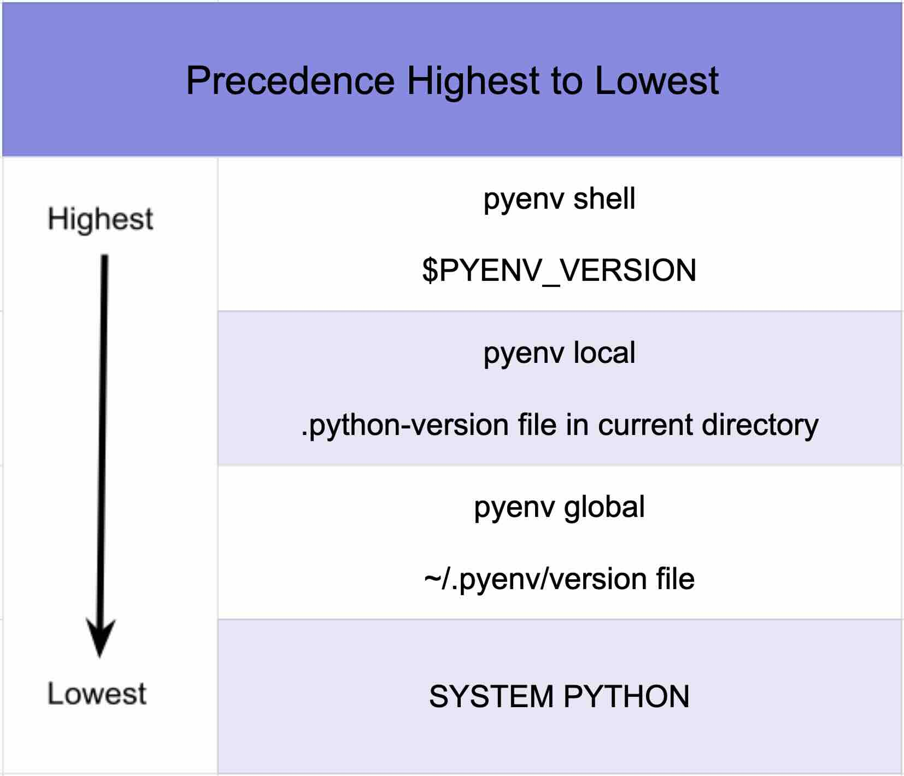

You're encountering a **common pain point** in Python development: **virtual environments (venvs) are tied to the specific Python interpreter** they were created with. When you upgrade or reinstall the base Python (e.g., from 3.11 to 3.12), the old `venv` becomes invalid because it points to a now-missing or incompatible interpreter.

Here’s a **scalable, long-term, industry-standard guideline** to avoid repeatedly recreating `venv`s manually.

---

## Recommended Long-Term Solution: **Use `pyenv` + `pipenv` or `poetry`**

This combo is the **gold standard** for scalable Python project management.

---

### Step 1: Use `pyenv` to Manage Python Versions (Never Touch System Python)

```bash
# Install pyenv (macOS/Linux)
curl https://pyenv.run | bash

# Or via Homebrew (macOS)
brew install pyenv
```

**Why?**
- Installs Python versions **in your home directory** (`~/.pyenv/versions`)
- No need to reinstall system Python
- Switch versions per-project or globally
- Survives OS upgrades, Python upgrades, etc.

```bash
# Running 'pyenv install -l' gives the list of all available versions.
pyenv install 3.12.7
pyenv install 3.11.9
```

**Outputs**
```bash
sap@Sanjays-MacBook-Air test-pyenv % pyenv install 3.13.3
python-build: use openssl@3 from homebrew
python-build: use readline from homebrew
Downloading Python-3.13.3.tar.xz...
-> https://www.python.org/ftp/python/3.13.3/Python-3.13.3.tar.xz
Installing Python-3.13.3...
python-build: use tcl-tk from homebrew
python-build: use readline from homebrew
python-build: use zlib from xcode sdk
Installed Python-3.13.3 to /Users/sap/.pyenv/versions/3.13.3
```

**checks**
```bash
sap@Sanjays-MacBook-Air test-pyenv % pyenv versions
* system (set by /Users/sap/.pyenv/version)
  3.13.3

sap@Sanjays-MacBook-Air test-pyenv % pyenv install -list
sap@Sanjays-MacBook-Air test-pyenv % pyenv install -l | less

# show current python version 
sap@Sanjays-MacBook-Air test-pyenv % pyenv version-name
system

# show global python version
sap@Sanjays-MacBook-Air test-pyenv % pyenv global
system

# show local python version 
sap@Sanjays-MacBook-Air test-pyenv % pyenv local 
pyenv: no local version configured for this directory

# show .pyenv versions 
sap@Sanjays-MacBook-Air test-pyenv % ls -l ~/.pyenv/versions                
total 0
drwxr-xr-x@ 6 sap  staff  192 Nov  5 00:12 3.13.3

# Automatically select whenever you are in the current directory (or its subdirectories):
# pyenv local <version>
sap@Sanjays-MacBook-Air test-pyenv % pyenv local system
sap@Sanjays-MacBook-Air test-pyenv % pyenv local       
system
sap@Sanjays-MacBook-Air test-pyenv % cat ./.python-version 
system
#    
sap@Sanjays-MacBook-Air test-pyenv % pyenv local 3.13.3
sap@Sanjays-MacBook-Air test-pyenv % pyenv local       
3.13.3
sap@Sanjays-MacBook-Air test-pyenv % cat ./.python-version 
3.13.3
# To Get currently set Python version using PyEnv
sap@Sanjays-MacBook-Air test-pyenv % pyenv version
3.13.3 (set by /Users/sap/mydev/GitHub/portfolio-python/0_begin_here/sandbox/test-pyenv/.python-version)

# Select globally for your user account:
# pyenv global <version>
sap@Sanjays-MacBook-Air test-pyenv % pyenv global
system
sap@Sanjays-MacBook-Air sandbox % pyenv version
system (set by /Users/sap/.pyenv/version)
sap@Sanjays-MacBook-Air sandbox % pyenv global 3.13.3
sap@Sanjays-MacBook-Air sandbox % pyenv versions     
  system
* 3.13.3 (set by /Users/sap/.pyenv/version)


# Select shell version 
# pyenv shell <version>
sap@Sanjays-MacBook-Air sandbox % pyenv shell
# pyenv: shell integration not enabled. Run `pyenv init' for instructions.

# # To unset a Python version set using PyEnv:
# pyenv shell --unset
# pyenv local --unset
# pyenv global --unset

```

**Pyenv Precedence Chart**


---

### Step 2: Use `poetry` (Recommended) or `pipenv` for Dependency & Environment Management

#### Option A: **`poetry`** (Modern, Fast, Standard in 2025)

```bash
curl -sSL https://install.python-poetry.org | python3 -

# OR use brew
brew cleanup --dry-run    # check for conflicts, etc. 
brew update
brew install poetry 
```

In your project:

```bash
cd my-project
pyenv local 3.12.7        # Auto-switch Python when entering dir
poetry env use 3.12.7     # Creates venv using pyenv's Python
poetry install            # Installs deps + creates lock file
```

On my system: 
```bash
##
mkdir test-poetry
cd test-poetry 
##
ls -la
drwxr-xr-x@ 2 sap  staff   64 Nov  7 03:01 .
drwxr-xr-x@ 6 sap  staff  192 Nov  7 03:01 ..
##
pyenv local 3.13.3
pyenv local       
3.13.3
##
ls -la
total 8
drwxr-xr-x@ 3 sap  staff   96 Nov  7 03:01 .
drwxr-xr-x@ 6 sap  staff  192 Nov  7 03:01 ..
-rw-r--r--@ 1 sap  staff    7 Nov  7 03:02 .python-version
##
cat .python-version 
3.13.3
##
poetry env use 3.13.3    # first problem - need to initialize pyproject.toml file

Poetry could not find a pyproject.toml file in /Users/sap/mydev/GitHub/portfolio-python/0_begin_here/sandbox/test-poetry or its parents
##
poetry about    # learn a bit more about poetry before shooting in the dark
Poetry - Package Management for Python

Version: 2.2.1
Poetry-Core Version: 2.2.1

Poetry is a dependency manager tracking local dependencies of your projects and libraries.
See https://github.com/python-poetry/poetry for more information.

##
poetry init

This command will guide you through creating your pyproject.toml config.

Package name [test-poetry]:  sap_demo
Version [0.1.0]:  0.1.0
Description []:  sap_demp_0.1.0
Author [sap <s@u.n.github.com>, n to skip]:  
License []:  MIL
Compatible Python versions [>=3.13]:  

Would you like to define your main dependencies interactively? (yes/no) [yes] 
        You can specify a package in the following forms:
          - A single name (requests): this will search for matches on PyPI
          - A name and a constraint (requests@^2.23.0)
          - A git url (git+https://github.com/python-poetry/poetry.git)
          - A git url with a revision         (git+https://github.com/python-poetry/poetry.git#develop)
          - A file path (../my-package/my-package.whl)
          - A directory (../my-package/)
          - A url (https://example.com/packages/my-package-0.1.0.tar.gz)
        
Package to add or search for (leave blank to skip): 

Would you like to define your development dependencies interactively? (yes/no) [yes] 
Package to add or search for (leave blank to skip): 

Generated file

[project]
name = "sap-demo"
version = "0.1.0"
description = "sap_demp_0.1.0"
authors = [
    {name = "sap",email = "s@u.n.github.com"}
]
license = {text = "MIL"}
readme = "README.md"
requires-python = ">=3.13"
dependencies = [
]


[build-system]
requires = ["poetry-core>=2.0.0,<3.0.0"]
build-backend = "poetry.core.masonry.api"


Do you confirm generation? (yes/no) [yes] 
##
ls -la
total 16
drwxr-xr-x@ 4 sap  staff  128 Nov  7 03:11 .
drwxr-xr-x@ 6 sap  staff  192 Nov  7 03:01 ..
-rw-r--r--@ 1 sap  staff    7 Nov  7 03:02 .python-version
-rw-r--r--@ 1 sap  staff  348 Nov  7 03:11 pyproject.toml
##
cat pyproject.toml 
[project]
name = "sap-demo"
version = "0.1.0"
description = "sap_demp_0.1.0"
authors = [
    {name = "sap",email = "sanjaysp91@users.noreply.github.com"}
]
license = {text = "MIL"}
readme = "README.md"
requires-python = ">=3.13"
dependencies = [
]


[build-system]
requires = ["poetry-core>=2.0.0,<3.0.0"]
build-backend = "poetry.core.masonry.api"
##
poetry env use 3.13.3
Creating virtualenv sap-demo-qXkoyfK8-py3.13 in /Users/sap/Library/Caches/pypoetry/virtualenvs
Using virtualenv: /Users/sap/Library/Caches/pypoetry/virtualenvs/sap-demo-qXkoyfK8-py3.13
##
which python3
/opt/homebrew/bin/python3
##
poetry install    # second set of issue 
Updating dependencies
Resolving dependencies... (0.1s)

Writing lock file

Installing the current project: sap-demo (0.1.0)
Error: The current project could not be installed: Readme path `/Users/sap/mydev/GitHub/portfolio-python/0_begin_here/sandbox/test-poetry/README.md` does not exist.
If you do not want to install the current project use --no-root.
If you want to use Poetry only for dependency management but not for packaging, you can disable package mode by setting package-mode = false in your pyproject.toml file.
If you did intend to install the current project, you may need to set `packages` in your pyproject.toml file.

##
poetry install --no-root    # of disable package-mode permanently 
Installing dependencies from lock file
##
ls -la
total 24
drwxr-xr-x@ 5 sap  staff  160 Nov  7 03:13 .
drwxr-xr-x@ 6 sap  staff  192 Nov  7 03:01 ..
-rw-r--r--@ 1 sap  staff    7 Nov  7 03:02 .python-version
-rw-r--r--@ 1 sap  staff  246 Nov  7 03:13 poetry.lock
-rw-r--r--@ 1 sap  staff  348 Nov  7 03:11 pyproject.toml

cat poetry.lock 
# This file is automatically @generated by Poetry 2.2.1 and should not be changed by hand.
package = []

[metadata]
lock-version = "2.1"
python-versions = ">=3.13"
content-hash = "43c15d4b40e26b9dc4090308565270876da3b72ef2b9fa0bddbe4b344cfe177c"

##
poetry shell    # third issue 

# Looks like you're trying to use a Poetry command that is not available.

Since Poetry (2.0.0), the shell command is not installed by default. You can use,

  - the new env activate command (recommended); or
  - the shell plugin to install the shell command

Documentation: https://python-poetry.org/docs/managing-environments/#activating-the-environment

Note that the env activate command is not a direct replacement for shell command.

##
poetry run which python3
/Users/sap/Library/Caches/pypoetry/virtualenvs/sap-demo-qXkoyfK8-py3.13/bin/python3
##
poetry env -h           
The requested command does not exist in the env namespace.

Did you mean one of these perhaps?
    env activate: Print the command to activate a virtual environment.
    env info: Displays information about the current environment.
    env list: Lists all virtualenvs associated with the current project.
    env remove: Remove virtual environments associated with the project.
    env use: Activates or creates a new virtualenv for the current project.

Documentation: https://python-poetry.org/docs/cli/#env

##
poetry env info

Virtualenv
Python:         3.13.3
Implementation: CPython
Path:           /Users/sap/Library/Caches/pypoetry/virtualenvs/sap-demo-qXkoyfK8-py3.13
Executable:     /Users/sap/Library/Caches/pypoetry/virtualenvs/sap-demo-qXkoyfK8-py3.13/bin/python
Valid:          True

Base
Platform:   darwin
OS:         posix
Python:     3.13.3
Path:       /Users/sap/.pyenv/versions/3.13.3
Executable: /Users/sap/.pyenv/versions/3.13.3/bin/python3.13

##
poetry env list
sap-demo-qXkoyfK8-py3.13 (Activated)
##
which python3
/opt/homebrew/bin/python3
##
poetry env activate
source /Users/sap/Library/Caches/pypoetry/virtualenvs/sap-demo-qXkoyfK8-py3.13/bin/activate
##
which python3      
/opt/homebrew/bin/python3
##
poetry env list    
sap-demo-qXkoyfK8-py3.13 (Activated)
##
source /Users/sap/Library/Caches/pypoetry/virtualenvs/sap-demo-qXkoyfK8-py3.13/bin/activate
(sap-demo-py3.13) sap@Sanjays-MacBook-Air test-poetry % which python3                                                                              
/Users/sap/Library/Caches/pypoetry/virtualenvs/sap-demo-qXkoyfK8-py3.13/bin/python3
##
(sap-demo-py3.13) sap@Sanjays-MacBook-Air test-poetry % deactivate
which python3
/opt/homebrew/bin/python3
##
source /Users/sap/Library/Caches/pypoetry/virtualenvs/sap-demo-qXkoyfK8-py3.13/bin/activate
(sap-demo-py3.13) sap@Sanjays-MacBook-Air test-poetry % ls -la
total 24
drwxr-xr-x@ 5 sap  staff  160 Nov  7 03:13 .
drwxr-xr-x@ 6 sap  staff  192 Nov  7 03:01 ..
-rw-r--r--@ 1 sap  staff    7 Nov  7 03:02 .python-version
-rw-r--r--@ 1 sap  staff  246 Nov  7 03:13 poetry.lock
-rw-r--r--@ 1 sap  staff  348 Nov  7 03:11 pyproject.toml
##
(sap-demo-py3.13) sap@Sanjays-MacBook-Air test-poetry % python3 -m tkinter    # GOT the GUI, finally! 
```
**Benefits:**
- `pyproject.toml` + `poetry.lock` = reproducible builds
- Auto-creates venv in **project-local** or **central cache** (`~/.cache/pypoetry/virtualenvs`)
- Survives Python upgrades (just run `poetry env use 3.13.0` later)
- No manual `python -m venv .venv`

#### Option B: `pipenv` (Still solid, slightly older)

```bash
pip install --user pipenv
cd my-project
pyenv local 3.12.7
pipenv install
```

Creates `Pipfile` + `Pipfile.lock`, manages venv automatically.

---

### Step 3: Automate with Shell + `.python-version`

`pyenv` reads `.python-version` in project root:

```bash
cd my-project
pyenv local 3.12.7   # creates .python-version
```

Now every time you `cd` in, correct Python is used.

---

### Step 4: Optional — Centralize venvs (Clean Project Dirs)

With `poetry`:

```bash
poetry config virtualenvs.in-project false   # default: centralized in ~/.cache
# or
poetry config virtualenvs.in-project true    # .venv inside project
```

With `pipenv`:

```bash
export PIPENV_VENV_IN_PROJECT=1   # creates .venv in project
```

---

## Workflow Summary (Scalable & Future-Proof)

| Step | Command |
|------|---------|
| 1. Enter project | `cd my-project` |
| 2. Auto-switch Python | `pyenv` reads `.python-version` |
| 3. Install deps | `poetry install` or `pipenv install` |
| 4. Upgrade Python later | `pyenv install 3.13.0 && poetry env use 3.13.0` |

> **No manual `venv` recreation. Ever.**

---

## Bonus: For Teams / CI/CD

```toml
# pyproject.toml (poetry)
[tool.poetry]
name = "myapp"
version = "0.1.0"

[tool.poetry.dependencies]
python = "^3.12"   # Enforced version range
```

```bash
# CI: Install exact Python + deps
pyenv install 3.12.7
poetry env use 3.12.7
poetry install --only=main
```

---

## What NOT to Do Long-Term

| Avoid | Why |
|------|-----|
| `python -m venv .venv` manually | Breaks on Python upgrade |
| System Python + global `pip install` | Pollutes system, not reproducible |
| `conda` (unless data science) | Heavy, slower, not needed for app dev |

---

## TL;DR: Your Standard Stack

```bash
# 1. Install once
brew install pyenv
curl -sSL https://install.python-poetry.org | python3 -

# 2. Per project
cd my-project
pyenv install 3.12.7
pyenv local 3.12.7
poetry init
poetry add requests flask
poetry install
```

**Upgrade Python later?**
```bash
pyenv install 3.13.0
poetry env use 3.13.0
poetry install
```

Done. No `venv` recreation. Ever.

---

**Official References:**
- [`pyenv`](https://github.com/pyenv/pyenv)
- [`poetry`](https://python-poetry.org/)
- [`pipenv`](https://pipenv.pypa.io/)

This is the **industry-standard, scalable, long-term solution** used by companies and top open-source projects in 2025.

---
---
---

# How does this solve Tkinter issue?
Great question — and **you're absolutely right to ask**.

**Tkinter is a *system-level* dependency** (it relies on the **Tcl/Tk libraries** bundled with the **Python interpreter**), **not** a pip-installable package. This means:

> **If your base Python interpreter doesn’t have Tkinter, no `venv`, `poetry`, or `pyenv` magic will fix it.**

So let's clarify:  
- `pyenv` + `poetry` **does NOT automatically solve Tkinter issues**  
- But it **helps you avoid and manage** them **predictably and scalably**

---

## The Real Tkinter Problem

| Cause | Symptom |
|------|--------|
| Python built **without Tcl/Tk** | `ImportError: Tkinter not available` |
| `pyenv install` used `--enable-shared` missing | No GUI |
| System Python on Linux (e.g. Ubuntu) | `apt` Python often **excludes Tk** |

---

## How `pyenv` + `poetry` **Helps Solve Tkinter Issues** (The Right Way)

### Step 1: Install Python with Tkinter Support via `pyenv`

```bash
# CRITICAL: Use python-build with --enable-framework (macOS) or ensure Tcl/Tk
# macOS (Homebrew provides Tcl/Tk)
pyenv install 3.12.7

# Linux (Ubuntu/Debian) — FIRST install system Tcl/Tk
sudo apt-get install -y make build-essential libssl-dev zlib1g-dev \
    libbz2-dev libreadline-dev libsqlite3-dev wget curl llvm \
    libncursesw5-dev xz-utils tk-dev libxml2-dev libxmlsec1-dev \
    libffi-dev liblzma-dev

# Then install Python with Tkinter
pyenv install 3.12.7
```

> **This ensures `tkinter` module is compiled in**

Verify:

```bash
pyenv shell 3.12.7
python -c "import tkinter; print(tkinter.TkVersion)"
# Should print: 8.6
```

---

### Step 2: Use That Python in Your Project

```bash
cd my-gui-project
pyenv local 3.12.7        # .python-version created
poetry env use 3.12.7     # venv uses pyenv's Tkinter-enabled Python
poetry install
```

Now:
```python
# app.py
import tkinter as tk
root = tk.Tk()
root.mainloop()
```

**Works every time**, even after Python upgrade.

---

### Step 3: Upgrade Python Later? Tkinter Still Works

```bash
# Later: Python 3.13 released
pyenv install 3.13.0
poetry env use 3.13.0
```

> `poetry` recreates the venv using the **new, Tkinter-enabled** Python  
> No manual fix needed

---

## Why This Beats Manual `venv` + System Python

| Approach | Tkinter Works After Python Upgrade? | Reproducible? | Scalable? |
|--------|-------------------------------------|-------------|-----------|
| `python3 -m venv .venv` + system Python | No (breaks if Python reinstalled) | No | No |
| `pyenv` + `poetry` | Yes (controlled build) | Yes | Yes |

---

## Common Pitfalls & Fixes

| Issue | Fix |
|------|-----|
| `ImportError: No module named '_tkinter'` | Reinstall Python via `pyenv` with `tk-dev` (Linux) or Homebrew Tcl/Tk (macOS) |
| `pyenv install` fails on Linux | Install `tk-dev` **before** `pyenv install` |
| macOS: Tkinter works in system Python but not pyenv | Use Homebrew: `brew install tcl-tk` then `pyenv install --with-tcl-tk` (or just `pyenv install` — works by default) |

---

## TL;DR: How This **Solves** the Tkinter Issue

| Problem | Solved By |
|--------|----------|
| Tkinter missing after Python upgrade | `pyenv` reinstalls **same config** with Tkinter |
| Manual `venv` breaks | `poetry env use 3.x` **recreates venv safely** |
| Inconsistent team setups | `.python-version` + `pyproject.toml` = **100% reproducible** |

---

## Final Recommended Setup (Tkinter-Proof)

```bash
# 1. System prep (Linux only)
sudo apt-get install tk-dev  # macOS: brew install tcl-tk

# 2. Install Python via pyenv
pyenv install 3.12.7

# 3. Project setup
cd my-tkinter-app
pyenv local 3.12.7
poetry init
poetry env use 3.12.7
poetry add pillow  # optional: for images in Tk

# 4. Test
poetry run python -c "import tkinter; print('Tkinter OK:', tkinter.TkVersion)"
```

**Upgrade later?**
```bash
pyenv install 3.13.0
poetry env use 3.13.0
# Tkinter still works
```

---

**Bottom Line**:  
`pyenv` + `poetry` **doesn’t auto-install Tkinter**, but it **gives you full control** over the Python build — so you **install it once correctly**, and **never lose it again**, even across upgrades.

That’s the **scalable, long-term, industry-standard fix**.

---
---
---
# Markdown formatted 
# Part 1: Scalable Long-Term Python Environment Setup  
*(Originally: “Every time I upgrade Python, my venv dies”)*

```markdown
You're encountering a **common pain point** in Python development:  
**virtual environments are tied to the specific interpreter** they were created with.  
When you upgrade/reinstall base Python (e.g. 3.11 → 3.12), the old `venv` breaks.

## Recommended Long-Term Solution  
**`pyenv` + `poetry` (or `pipenv`)** — the 2025 gold standard.

### 1. Install `pyenv` (Never Touch System Python)
```bash
# macOS
brew install pyenv

# Linux
curl https://pyenv.run | bash
```

```bash
pyenv install 3.12.7
pyenv install 3.11.9
```

### 2. Use `poetry` (Modern & Fast)
```bash
curl -sSL https://install.python-poetry.org | python3 -
```

```bash
cd my-project
pyenv local 3.12.7          # creates .python-version
poetry env use 3.12.7
poetry install
```

**Zero manual `venv` recreation — ever.**

### 3. Upgrade Python Later
```bash
pyenv install 3.13.0
poetry env use 3.13.0
poetry install
```

### 4. Team / CI Ready
`pyproject.toml` locks exact Python + deps.

### What NOT to Do
| Avoid                  | Why                              |
|------------------------|----------------------------------|
| Manual `python -m venv` | Breaks on upgrade                |
| Global `pip install`    | Pollutes system, not reproducible|
| Conda (unless DS)       | Heavy & slow                     |

### TL;DR One-Liner Setup
```bash
brew install pyenv
curl -sSL https://install.python-poetry.org | python3 -
cd my-project && pyenv install 3.12.7 && pyenv local 3.12.7 && poetry init
```

Industry-standard, used by top OSS projects in 2025.
```

---

# Part 2: Tkinter-Proof Setup  
*(“How does this solve Tkinter issues?”)*

```markdown
**Tkinter is NOT pip-installable** — it needs **Tcl/Tk baked into the interpreter**.

`pyenv` + `poetry` **doesn’t auto-install Tkinter**,  
but gives **full control** so you **install it once correctly** and **never lose it**.

## Step-by-Step Tkinter-Proof Workflow

### 1. System Prep (Linux only)
```bash
sudo apt-get install -y tk-dev
# macOS: brew install tcl-tk  (usually already there)
```

### 2. Install Python WITH Tkinter
```bash
pyenv install 3.12.7   # pulls system Tcl/Tk → tkinter works
```

Verify:
```bash
pyenv shell 3.12.7
python -c "import tkinter; print(tkinter.TkVersion)"
# → 8.6
```

### 3. Project Setup
```bash
cd my-gui-app
pyenv local 3.12.7
poetry env use 3.12.7
poetry install
```

```python
# app.py
import tkinter as tk
root = tk.Tk(); root.mainloop()
```

### 4. Upgrade Python Later → Still Works
```bash
pyenv install 3.13.0
poetry env use 3.13.0   # recreates venv with NEW Tkinter-enabled Python
```

## Why This Beats Manual `venv`

| Approach               | Survives Upgrade? | Reproducible? | Scalable? |
|------------------------|-------------------|---------------|-----------|
| Manual `venv` + system | No                | No            | No        |
| `pyenv` + `poetry`     | Yes               | Yes           | Yes       |

## Common Errors & Fixes
| Error                               | Fix                                      |
|-------------------------------------|------------------------------------------|
| `_tkinter module not found`         | Reinstall via `pyenv` **after** `tk-dev` |
| macOS: works in system, not pyenv   | `brew install tcl-tk` then reinstall    |

## Final One-Command Project Bootstrap
```bash
sudo apt-get install tk-dev && \
pyenv install 3.12.7 && \
cd my-tk-app && pyenv local 3.12.7 && \
poetry init && poetry env use 3.12.7 && \
poetry run python -c "import tkinter, sys; print('Ready:', tkinter.TkVersion)"
```

**Bottom line:**  
`pyenv` builds Python **with Tkinter every time**.  
`poetry` recreates the venv safely.  
→ **Tkinter never breaks again**, even across major upgrades.
```

Copy-paste either block into any `.md` file and you’re done! 🚀